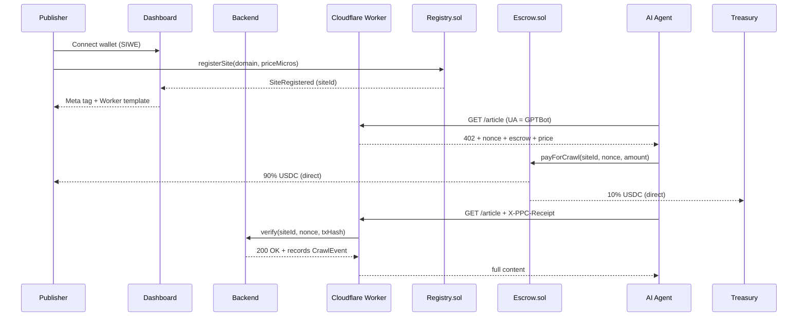

# PayPerCrawl

Pay-per-crawl micropayments for the agentic web. Publishers register a site, get a unique on-chain identifier, and AI agents pay USDC on Base every time they crawl. Funds split atomically: **publisher 90%, treasury 10%**.



## Live deployment (Base Sepolia)

| Contract | Address |
| --- | --- |
| `PayPerCrawlRegistry` | `0x1dAC1D679fb7BaeF7e849B84091D43842822871A` |
| `PayPerCrawlEscrow` | `0xB57aa7C00762ffe2412A0103d757a762D1983146` |
| `PayPerCrawlTreasury` | `0x05C3C3Ade003C91F7Fd2D1b532C5eB3BAe600932` |
| USDC (Circle Base Sepolia) | `0x036CbD53842c5426634e7929541eC2318f3dCF7e` |

Source of truth: [`contracts/deployments/base-sepolia.json`](contracts/deployments/base-sepolia.json).

## Monorepo

```text
PayPercrawl/
├── frontend/                  TanStack Start + wagmi (Spline marketing site + dashboard)
├── backend/                   Express + Prisma + viem (SIWE, sites, gateway/verify)
├── contracts/                 Hardhat (Registry + Escrow + Treasury)
└── frontend/public/templates/ Cloudflare Worker template
```

## Publisher journey (the entire UX)

1. **Sign in with wallet** at `/login` — SIWE flow, no email/password. The connected address is your earnings wallet.
2. **Register a site** at `/dashboard/sites/new` — enter your domain and price (default 0.001 USDC). One transaction calls `Registry.registerSite` and your dashboard records the on-chain `siteId`.
3. **Copy the snippet** from `/dashboard/sites/<id>`:
   - Tab 1 — meta tag for cooperative agents that read tags before crawling.
   - Tab 2 — Cloudflare Worker template that returns HTTP 402 to bot User-Agents and only forwards once an on-chain receipt is presented.
4. **Earn passively** — every paid crawl shows up in the events tab with the agent address, USDC earned, and tx hash. Funds arrive in your wallet immediately; no withdraw step.

## Tech stack

| Layer | Stack |
| --- | --- |
| Frontend | TanStack Start, React 19, wagmi, viem, Tailwind v4, Spline hero |
| Backend | Express 5, Prisma, PostgreSQL (Supabase), optional Upstash Redis, viem |
| Contracts | Solidity 0.8.24, OpenZeppelin, Hardhat 2 |
| Chain | Base Sepolia (USDC) — mainnet-ready by swapping `BASE_RPC_URL` + USDC address |
| Gateway | Cloudflare Worker (template at `frontend/public/templates/worker.js`) |

## Quick start

### 1. Install

```bash
npm install
npm install --prefix frontend
npm install --prefix backend
npm install --prefix contracts
```

### 2. Environment

```bash
cp backend/.env.example backend/.env
cp frontend/.env.example frontend/.env
cp contracts/.env.example contracts/.env
```

Required in [`backend/.env`](backend/.env.example):

- `DATABASE_URL` — Supabase (direct or pooler) Postgres URL.
- `JWT_SECRET` — `openssl rand -base64 48`.
- `BASE_RPC_URL` — public Base Sepolia or your Alchemy RPC.
- `REDIS_URL` *(optional)* — set only for rate-limiting; rate-limiting auto-disables when unset.

Required in [`contracts/.env`](contracts/.env.example):

- `BASE_SEPOLIA_RPC_URL`, `DEPLOYER_PRIVATE_KEY` (testnet only).
- `PROTOCOL_FEE_BPS=1000` (10%).

### 3. Database

```bash
cd backend
npm run prisma:migrate:deploy
```

### 4. Deploy contracts (only needed once per chain)

```bash
cd contracts
npm test                       # 8 Hardhat tests
npm run deploy:sepolia         # writes contracts/deployments/base-sepolia.json
```

The backend reads `base-sepolia.json` at boot, so re-deploying just requires restarting the API.

### 5. Run

```bash
# Backend (http://localhost:3001)
npm run dev:backend

# Frontend (http://localhost:5173)
npm run dev:frontend

# Both at once
npm run dev
```

## API surface (simplified)

| Method | Path | Auth | Purpose |
| --- | --- | --- | --- |
| `GET` | `/api/health` | public | DB / Redis / chain status |
| `POST` | `/api/auth/siwe/nonce` | public | SIWE nonce |
| `POST` | `/api/auth/siwe/verify` | public | verify SIWE signature, set cookie |
| `POST` | `/api/auth/logout` | session | clear cookie |
| `GET` | `/api/me` | session | current user |
| `GET` | `/api/sites` | session | publisher's registered sites |
| `POST` | `/api/sites` | session | record an on-chain registerSite tx |
| `GET` | `/api/sites/:id` | session | site detail + earnings + chain config |
| `PATCH` | `/api/sites/:id/price` | session | mirror an on-chain `updatePrice` |
| `GET` | `/api/sites/:id/events` | session | recent paid crawls |
| `GET` | `/api/sites/:id/snippet` | session | meta tag + Worker config |
| `GET` | `/gateway/check?domain=...` | public | returns HTTP 402 + payment terms |
| `POST` | `/api/gateway/verify` | public | Worker verifies a tx receipt → 200 |

## On-chain split

```text
amount = priceMicros (USDC, 6 decimals)
publisherCut = amount - protocolCut
protocolCut  = amount * 1000 / 10000   (10%)
```

For the default price `1000` micros (0.001 USDC) the publisher receives `900` micros (0.0009 USDC) and the treasury receives `100` micros (0.0001 USDC). All in a single `payForCrawl` transaction — no settler, no held funds.

## Cloudflare Worker

The template at [`frontend/public/templates/worker.js`](frontend/public/templates/worker.js) detects AI bot user agents, returns `402` with a fresh nonce, and forwards real requests once the agent presents `X-PPC-Receipt` (a tx hash) and `X-PPC-Nonce`.

Wire your domain at Cloudflare → set the env vars (`PPC_SITE_ID`, `PPC_API_BASE`, `PPC_ESCROW`, `PPC_USDC`, `PPC_PRICE_MICROS`, `PPC_ORIGIN`) → done.

## Security notes

- Never commit real `.env` files or mainnet private keys.
- The deployer key in [`contracts/.env`](contracts/.env) is testnet-only; rotate it before any real deploy.
- `JWT_SECRET` must be at least 32 random bytes.
- For production, switch `DATABASE_URL` to the Supabase pooler URL (port 6543) with `?pgbouncer=true&connection_limit=1`.

## Roadmap (post-MVP)

- Treasury yield generation (Aave on Base) for the protocol cut.
- One-tx publisher onboarding with Coinbase Smart Wallet (no manual gas).
- WordPress / Next.js middleware variants alongside the Worker template.
- Mainnet USDC (`0x833589fCD6eDb6E08f4c7C32D4f71b54bdA02913`).

## License

Private — see repository owner.
